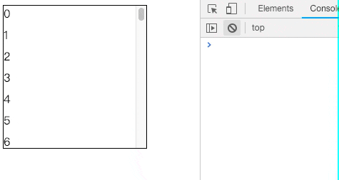
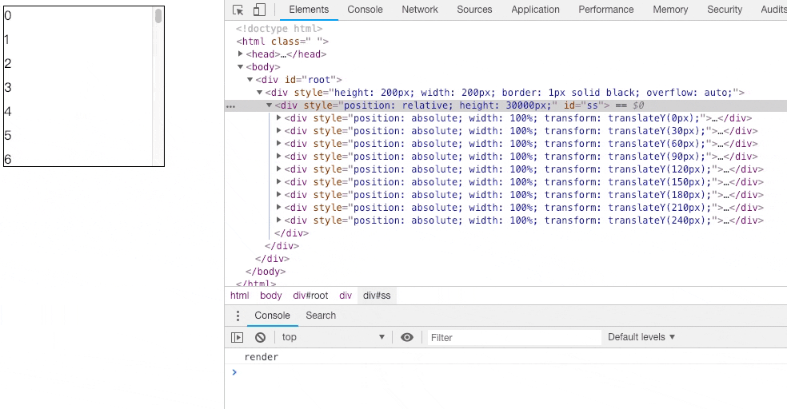
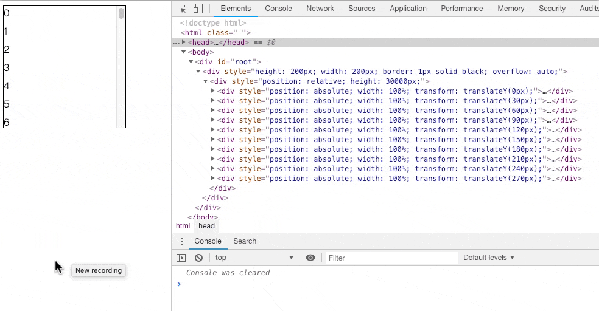

# 为什么使用虚拟列表

在我们的业务场景中遇到这么一个问题，有一个商户下拉框选择列表，我们简单的使用 antd 的 select 组件，发现每次点击下拉框，从点击到弹出会存在很严重的卡顿，在本地测试时，数据库只存在 370 条左右数据，这个量级的数据都能感到很明显的卡顿了（开发环境约 700+ms），更别提线上 2000+ 的数据了。Antd 的 select 性能确实不敢恭维，它会简单的将全部数据 map 出来，在点击的时候初始化并保存在 document.body 下的一个 DOM 节点中缓存起来，这又带来了另一个问题，我们的场景中，商户选择列表很多模块都用到了，每次点击之后都会新生成 2000+ 的 DOM 节点，如果把这些节点都存到 document 下，会造成 DOM 节点数量暴涨。

虚拟列表就是为了解决这种问题而存在的。

# 虚拟列表原理

虚拟列表本质就是使用少量的 DOM 节点来模拟一个长列表。如下图左所示，不论多长的一个列表，实际上出现在我们视野中的不过只是其中的一部分，这时对我们来说，在视野外的那些 item 就不是必要的存在了，如图左中 item 5 这个元素）。即使去掉了 item 5 （如右图），对于用户来说看到的内容也完全一致。


下面我们来一步步将步骤分解，具体代码可以查看 [Online Demo](https://stackblitz.com/edit/react-ts-virtuallist)。

这里是我通过这种思想实现的一个库，功能会更完善些。

https://github.com/musicq/vist

## 创建适合容器高度的 DOM 元素

以上图为例，想象一个拥有 1000 元素的列表，如果使用上图左的方式的话，就需要创建 1000 个 DOM 节点添加在 document 中，而其实每次出现在视野中的元素，只有 4 个，那么剩余的 996 个元素就是浪费。而如果就只创建 4 个 DOM 节点的话，这样就能节省 996 个 DOM 节点的开销。

### 解题思路

> 真实 DOM 数量 = Math.ceil(容器高度 / 条目高度)

定义组件有如下接口

```typescript
interface IVirtualListOptions {
  height: number;
}

interface IVirtualListProps {
  data$: Observable<string[]>;
  options$: Observable<IVirtualListOptions>;
}
```

首先需要有一个容器高度的流来装载容器高度

```typescript
 private containerHeight$ = new BehaviorSubject<number>(0)
```

需要在组件 mount 之后，才能测量容器的真实高度。可以通过一个 ref 来绑定容器元素，在 `componentDidMount` 之后，获取容器高度，并通知 `containerHeight$`。

```typescript
this.containerHeight$.next(virtualListContainerElm.clientHeight);
```

获取了容器高度之后，根据上面的公式来计算视窗内应该显示的 DOM 数量

```typescript
const actualRows$ = combineLatest(
  this.containerHeight$,
  this.props.options$
).pipe(map(([ch, { height }]) => Math.ceil(ch / height)));
```

通过组合 `actualRows$` 和 `data$` 两个流，来获取到应当出现在视窗内的数据切片

```typescript
const dataInViewSlice$ = combineLatest(this.props.data$, actualRows$).pipe(
  map(([data, actualRows]) => data.slice(0, actualRows))
);
```

这样，一个当前时刻的数据源就获取到了，订阅它来将列表渲染出来

```typescript
dataInViewSlice$.subscribe(data => this.setState({ data }));
```

**效果**


给定的数据有 1000 条，只渲染了前 7 条数据出来，这符合预期。

现在存在另一个问题，容器的滚动条明显不符合 1000 条数据该有的高度，因为我们只有 7 条真实 DOM，没有办法将容器撑开。

## 撑开容器

在原生的列表实现中，我们不需要处理任何事情，只需要把 DOM 添加到 document 中就可以了，浏览器会计算容器的真实高度，以及滚动到什么位置会出现什么元素。但是虚拟列表不会，这就需要我们自行解决容器的高度问题。

为了能让容器看起来和真的拥有 1000 条数据一样，就需要将容器的高度撑开到 1000 条元素该有的高度。这一步很容易，参考下面公式

### 解题思路

> 真实容器高度 = 数据总数 \* 每条 item 的高度

将上述公式换成代码

```typescript
const scrollHeight$ = combineLatest(this.props.data$, this.props.options$).pipe(
  map(([data, { height }]) => data.length * height)
);
```

**效果**


这样看起来就比较像有 1000 个元素的列表了。

但是滚动之后发现，下面全是空白的，由于列表只存在 7 个元素，空白是正常的。而我们期望随着滚动，元素能正确的出现在视野中。

## 滚动列表

这里有三种实现方式，而前两种基本一样，只有细微的差别，我们先从最初的方案说起。

### 完全重刷列表

这种方案是最简单的实现，我们只需要在列表滚动到某一位置的时候，去计算出当前的视窗中列表的索引，有了索引就能得到当前时刻的数据切片，从而将数据渲染到视图中。

为了让列表效果更好，我们将渲染的真实 DOM 数量多增加 3 个

```typescript
const actualRows$ = combineLatest(
  this.containerHeight$,
  this.props.options$
).pipe(map(([ch, { height }]) => Math.ceil(ch / height) + 3));
```

首先定义一个视窗滚动事件流

```typescript
const scrollWin$ = fromEvent(virtualListElm, "scroll").pipe(
  startWith({ target: { scrollTop: 0 } })
);
```

在每次滚动的时候去计算当前状态的索引

```typescript
const shouldUpdate$ = combineLatest(
  scrollWin$.pipe(map(() => virtualListElm.scrollTop)),
  this.props.options$,
  actualRows$
).pipe(
  // 计算当前列表中最顶部的索引
  map(([st, { height }, actualRows]) => {
    const firstIndex = Math.floor(st / height);
    const lastIndex = firstIndex + actualRows - 1;
    return [firstIndex, lastIndex];
  })
);
```

这样就能在每一次滚动的时候得到视窗内数据的起止索引了，接下来只需要根据索引算出 data 切片就好了。

```typescript
const dataInViewSlice$ = combineLatest(this.props.data$, shouldUpdate$).pipe(
  map(([data, [firstIndex, lastIndex]]) =>
    data.slice(firstIndex, lastIndex + 1)
  )
);
```

拿到了正确的数据，还没完，想象一下，虽然我们随着滚动的发生计算出了正确的数据切片，但是正确的数据却没有出现在正确的位置，因为他们的位置是固定不变的。

因此还需要对元素的位置做位移（逮虾户）的操作，首先修改一下传给视图的数据结构

```typescript
const dataInViewSlice$ = combineLatest(
  this.props.data$,
  this.props.options$,
  shouldUpdate$
).pipe(
  map(([data, { height }, [firstIndex, lastIndex]]) => {
    return data.slice(firstIndex, lastIndex + 1).map(item => ({
      origin: item,
      // 用来定位元素的位置
      $pos: firstIndex * height,
      $index: firstIndex++
    }));
  })
);
```

接下把 HTML 结构也做一下修改，将每一个元素的位移添加进去

```typescript
this.state.data.map(data => (
  <div
    key={data.$index}
    style={{
      position: "absolute",
      width: "100%",
      // 定位每一个 item
      transform: `translateY(${data.$pos}px)`
    }}
  >
    {(this.props.children as any)(data.origin)}
  </div>
));
```

这样就完成了一个虚拟列表的基本形态和功能了。

**效果如下**


但是这个版本的虚拟列表并不完美，它存在以下几个问题

1. 计算浪费
2. DOM 节点的创建和移除

#### 计算浪费

每次滚动都会使得 data 发生计算，虽然借助 virtual DOM 会将不必要的 DOM 修改拦截掉，但是还是会存在计算浪费的问题。

**实际上我们确实应该触发更新的时机是在当前列表的索引发生了变化的时候**，即开始我的列表索引为 `[0, 1, 2]`，滚动之后，索引变为了 `[1, 2, 3]`，这个时机是我们需要更新视图的时机。借助于 rxjs 的操作符，可以很轻松的搞定这个事情，只需要把 `shouldUpdate$` 流做一次过滤操作即可。

```typescript
const shouldUpdate$ = combineLatest(
  scrollWin$.pipe(map(() => virtualListElm.scrollTop)),
  this.props.options$,
  actualRows$
).pipe(
  // 计算当前列表中最顶部的索引
  map(([st, { height }, actualRows]) => [Math.floor(st / height), actualRows]),
  // 如果索引有改变，才触发重新 render
  filter(([curIndex]) => curIndex !== this.lastFirstIndex),
  // update the index
  tap(([curIndex]) => (this.lastFirstIndex = curIndex)),
  map(([firstIndex, actualRows]) => {
    const lastIndex = firstIndex + actualRows - 1;
    return [firstIndex, lastIndex];
  })
);
```

**效果**



#### DOM 节点的创建和移除

如果仔细对比会发现，每次列表发生更新之后，是会发生 DOM 的创建和删除的，如下图所示，在滚动了之后，原先位于列表中的第一个节点被移除了。


而我期望的理想的状态是，能够重用 DOM，不去删除和创建它们，这就是第二个版本的实现。

### 复用 DOM 重刷列表

为了达到节点的复用，我们需要将列表的 key 设置为数组索引，而非一个唯一的 id，如下

```typescript
this.state.data.map((data, i) => <div key={i}>{data}</div>);
```

只需要这一点改动，再看看效果


可以看到数据变了，但是 DOM 并没有被移除，而是被复用了，这是我想要的效果。

观察一下这个版本的实现与上一版本有何区别



是的，这个版本，每一次 render 都会使得整个列表样式发生变化，而且还有一个问题，就是列表滚动到最后的时候，会发生 DOM 减少的情况，虽然并不影响显示，但是还是有 DOM 的创建和移除的问题存在。

### 复用 DOM + 按需更新列表

为了能让列表只按照需要进行更新，而不是全部重刷，我们就需要明确知道有哪些 DOM 节点被移出了视野范围，操作这些视野范围外的节点来补充列表，从而完成列表的按需更新，如下图


假设用户在向下滚动列表的时候，item 1 的 DOM 节点被移出了视野，这时我们就可以把它移动到 item 5 的位置，从而完成一次滚动的连续，**这里我们只改变了元素的位置，并没有创建和删除 DOM**。

`dataInViewSlice$` 流依赖`props.data$`、`props.options$`、`shouldUpdate$`三个流来计算出当前时刻的 data 切片，而视图的数据完全是根据 `dataInViewSlice$` 来渲染的，所以如果想要按需更新列表，我们就需要在这个流里下手。

在容器滚动的过程中存在如下几种场景

1. 用户慢慢地**向上**或者**向下**滚动：移出视野的元素是一个接一个的
2. 用户直接**跳转**到列表的一个指定位置：这时整个列表都可能完全移出视野

但是这两种场景其实都可以归纳为一种情况，都是**求前一种状态与当前状态之间的索引差集**。

#### 实现

在 `dataInViewSlice$` 流中需要做两步操作。第一，在初始加载，还没有数组的时候，填充一个数组出来；第二，根据滚动到当前时刻时的起止索引，计算出二者的索引差集，更新数组，这一步便是按需更新的核心所在。

先来实现第一步，只需要稍微改动一下原先的 `dataInViewSlice$` 流的 map 实现即可完成初始数据的填充

```typescript
const dataSlice = this.stateDataSnapshot;

if (!dataSlice.length) {
  return (this.stateDataSnapshow = data
    .slice(firstIndex, lastIndex + 1)
    .map(item => ({
      origin: item,
      $pos: firstIndex * height,
      $index: firstIndex++
    })));
}
```

接下来完成按需更新数组的部分，首先需要知道滚动前后两种状态之间的索引差异，比如滚动前的索引为 `[0,1,2]`，滚动后的索引为 `[1,2,3]`，那么他们的差集就是 `[0]`，说明老数组中的第一个元素被移出了视野，那么就需要用这第一个元素来补充到列表最后，成为最后一个元素。

首先将数组差集求出来

```typescript
// 获取滚动前后索引差集
const diffSliceIndexes = this.getDifferenceIndexes(
  dataSlice,
  firstIndex,
  lastIndex
);
```

有了差集就可以计算新的数组组成了。还以此图为例，用户向下滚动，当元素被移除视野的时候，第一个元素（索引为 0）就变成最后一个元素（索引为 4），也就是，oldSlice `[0,1,2,3]` -> newSlice `[1,2,3,4]`。


在变换的过程中，`[1,2,3]` 三个元素始终是不需要动的，因此我们只需要截取不变的 `[1,2,3]`再加上新的索引 4 就能变成 `[1,2,3,4]`了。

```typescript
// 计算视窗的起始索引
let newIndex = lastIndex - diffSliceIndexes.length + 1;

diffSliceIndexes.forEach(index => {
  const item = dataSlice[index];
  item.origin = data[newIndex];
  item.$pos = newIndex * height;
  item.$index = newIndex++;
});

return (this.stateDataSnapshot = dataSlice);
```

这样就完成了一个向下滚动的数组拼接，如下图所示，DOM 确实是只更新超出视野的元素，而没有重刷整个列表。


但是这只是针对向下滚动的，如果往上滚动，这段代码就会出问题。原因也很明显，数组在向下滚动的时候，是往下补充元素，而向上滚动的时候，应该是向上补充元素。如 `[1,2,3,4]` -> `[0,1,2,3]`，对它的操作是 `[1,2,3]` 保持不变，而 4 号元素变成了 0 号元素，所以我们需要根据不同的滚动方向来补充数组。

先创建一个获取滚动方向的流 `scrollDirection$`

```typescript
const scrollDirection$ = scrollTop$.pipe(
  map(scrollTop => {
    const dir = scrollTop - this.lastScrollPos;
    this.lastScrollPos = scrollTop;
    return dir > 0 ? 1 : -1;
  })
);
```

将 `scrollDirection$` 流加入到 `dataInViewSlice$` 的依赖中

```typescript
const dataInViewSlice$ = combineLatest(
  this.props.data$,
  this.options$,
  shouldUpdate$
).pipe(withLatestFrom(scrollDirection$));
```

有了滚动方向，我们只需要修改 newIndex 就好了

```typescript
// 向下滚动时 [0,1,2,3] -> [1,2,3,4] = 3
// 向上滚动时 [1,2,3,4] -> [0,1,2,3] = 0
let newIndex = dir > 0 ? lastIndex - diffSliceIndexes.length + 1 : firstIndex;
```

至此，一个功能完善的按需更新的虚拟列表就基本完成了，效果如下



是不是还差了什么？

没错，我们还没有解决列表滚动到最后时会创建、删除 DOM 的问题了。

分析一下问题原因，应该能想到是 `shouldUpdate$` 这里在最后一屏的时候，计算出来的索引与最后一个索引的差小于了 `actualRows$` 中计算出来的数，所以导致了列表数量的变化，知道了原因就好解决问题了。

我们只需要计算出数组在维持真实 DOM 数量不变的情况下，最后一屏的起始索引应为多少，再和计算出来的视窗中第一个元素的索引进行对比，取二者最小为下一时刻的起始索引。

计算最后一屏的索引时需要得知 data 的长度，所以先将 data 依赖拉进来

```typescript
const shouldUpdate$ = combineLatest(
  scrollWin$.pipe(map(() => virtualListElm.scrollTop)),
  this.props.data$,
  this.props.options$,
  actualRows$
);
```

然后来计算索引

```typescript
// 计算当前列表中最顶部的索引
map(([st, data, { height }, actualRows]) => {
  const firstIndex = Math.floor(st / height);
  // 在维持 DOM 数量不变的情况下计算出的索引
  const maxIndex = data.length - actualRows < 0 ? 0 : data.length - actualRows;
  // 取二者最小作为起始索引
  return [Math.min(maxIndex, firstIndex), actualRows];
});
```

这样就真正完成了完全复用 DOM + 按需更新 DOM 的虚拟列表组件。

---

Github

https://github.com/musicq/vist

上述代码具体请看在线 DEMO

[Online Demo](https://stackblitz.com/edit/react-ts-virtuallist)。
